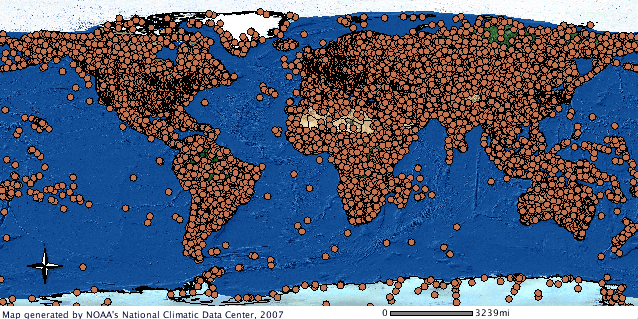
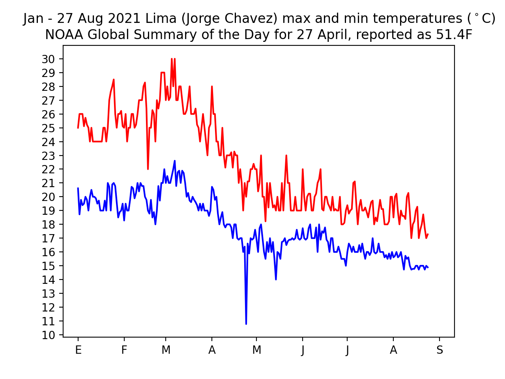
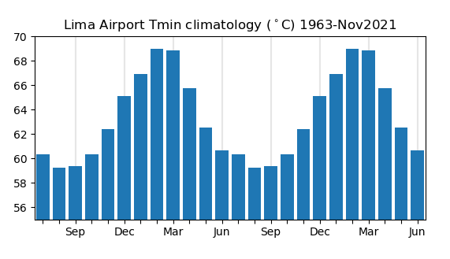
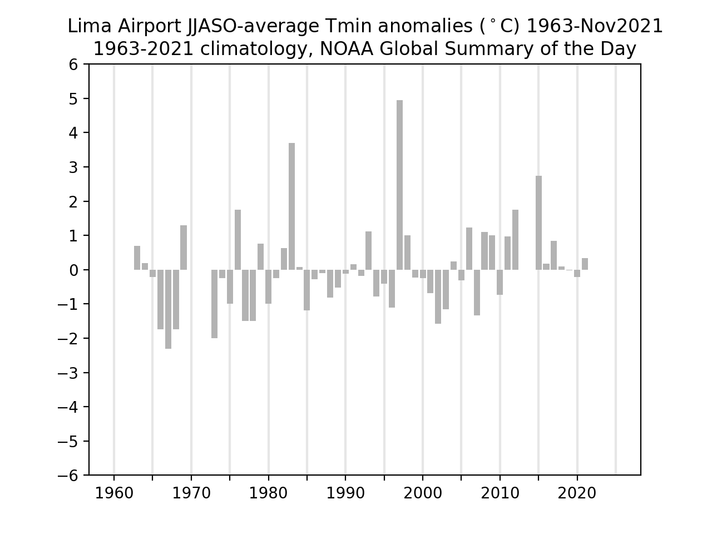

# Global-climate-from-station-data

The purpuse of this repository is to share code to analyze Global Summary of the Day (GSOD) data, a daily dataset of land station data that is free, distributed without restrictions, well-documented, and updated daily by the <a href="https://data.noaa.gov/dataset/dataset/global-surface-summary-of-the-day-gsod">U.S. National Oceanic and Atmospheric Administration (NOAA)</a>.  Kudos to NOAA for their efforts, leadership, and this contribution to the climate community.  There are approximately 9000 GSOD stations around the world.

The GSOD data comprise temperature, pressure, precipitation, a humidity variable, wind, and other variables.

Station data is valuable because these are raw observations.  Station measurements have errors like all data do, but they are the best record of the surface climate.

Station data are a great complement to reanalysis data, global datasets that are derived from land station, ships at sea, and satellite observations that have been analyzed with the equations of atmospheric motion, mass conservation, and thermodynamic energy.  Reanalysis datasets have the virtue of being spatially and temporally complete, they are of very good quality, and they easy to analyze.

My impression is that, although station data is an input to reanalysis, the reanalysis fields tend to be strongly determined by the satellite data input.  For this reason, the reanalysis and station data are not exactly the same, and the analysis of station data itself remains valuable.  

Intial steps in analyzing GSOD data are to produce an inventory of the stations locations and periods of observations; and to figure out how to read and make simple plots of the data for individual stations.  The former is important, underway, and not very exciting; I will first post code and analyses for the latter here.  

The following images, given here with minimal explanation, provide a sense of the kinds of analyses one can do with the the GSOD data.  

The native temporal resolution of the GSOD data is daily.  There are the daily minimum and maximum temperatures measured at the Lima Perú airport (Jorge Chavez International) for part of 2021.

  
  

  
A monthly climatology of minimum temperatures for Lima, as measured at the airport. June through October experience the coldest minimum temperatures throughout the year.

  

  
  The long term variability of Lima cold season (June through October) minimum temperatures.  The values are plotted as deviation from the long-term mean.
  

  
  

Todd Mitchell, December 2021, toddclimate@gmail.com

